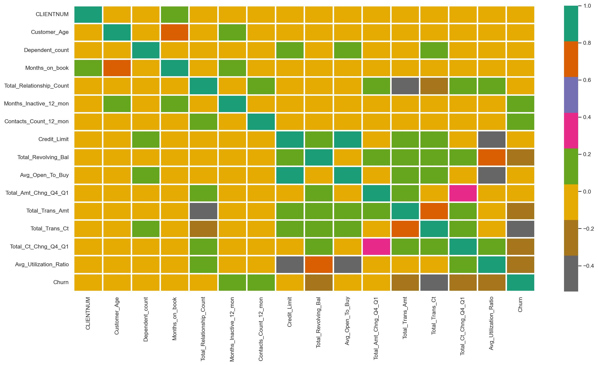
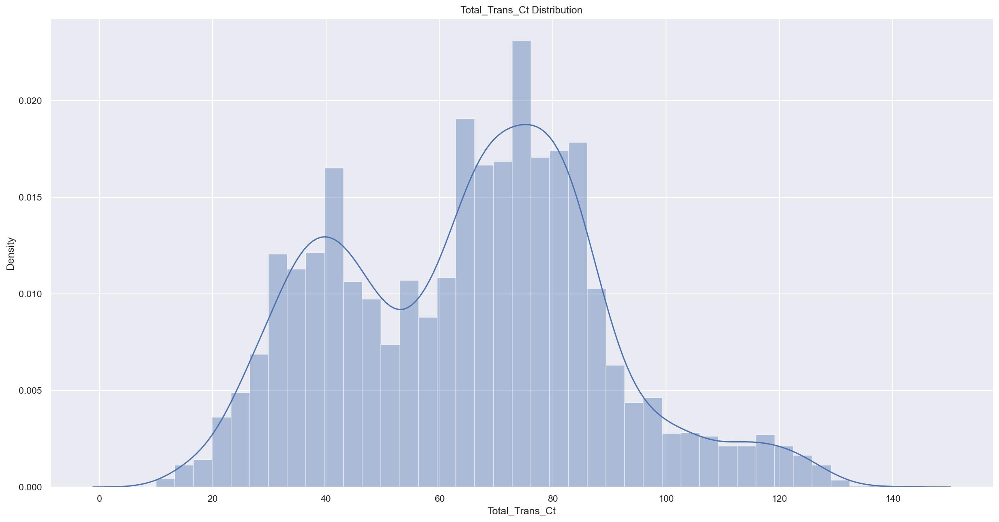
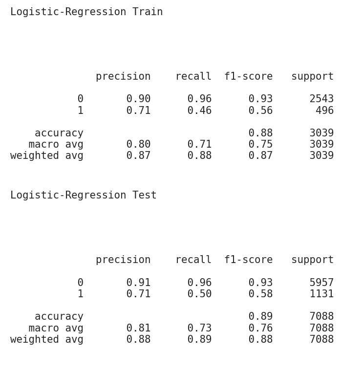
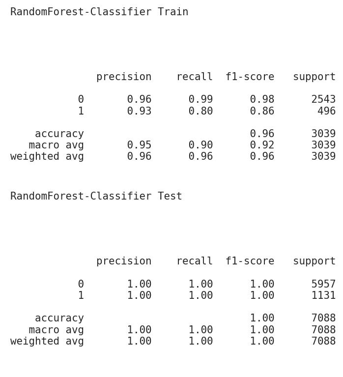

<h1>Churn Prediction: <i>with clean code</i> </h1>

<h2>Table of Content</h2>
<!-- TOC -->

- [Overview](#overview)
- [Project Requirements](#project-requirements)
- [Project Steps](#project-steps)
  - [Data Ingestion](#data-ingestion)
  - [Exploratory Data Analysis(EDA)](#exploratory-data-analysiseda)
    - [Correlation Heatmap](#correlation-heatmap)
    - [Total Transactions Completed Density plot](#total-transactions-completed-density-plot)
  - [Data Preprocessing](#data-preprocessing)
  - [Model Training and Evaluation](#model-training-and-evaluation)
    - [Logistic Regression  Classification Report](#logistic-regression--classification-report)
    - [Random Forest Classifier Classification Report](#random-forest-classifier-classification-report)
- [Tests](#tests)

<!-- /TOC -->

## Overview
This project is aimed at creating clean code from the pre-prepared churn prediction solution in [churn_notebook.ipynb](churn_notebook.ipynb). The churn prediction solution contained in the notebook simply is a machine learning classification solution that predicts if credit card customers of companies would churn or not. While this project takes in a `ready-made` machine learning solution, the major aim here is to restructure the `solution` to suit clean code principles which includes;
- Refactoring the code contained in the notebook
- Modularization
- Unit testing
- And following a coding style guide, for this project; `PEP 8` style guide is embraced. Most scripts in this project score above 8 out of 10 with `pylint`, this can be verified using `churn_library.py` and `main.py` as examples;
```
$ pylint src/churn_library.py
$ pylint main.py
```

## Project Requirements
To install the requirements for this project, you can easily run;
```
pip install -r requirements.txt
```
## Project Steps
### Data Ingestion
This projects has its major functionalities stored in a python dataclass; `ChurnModel` and for the data ingestion, the method `import_data` is called on the dataset; this imports the data and also creates the target column `Churn` from the existing categorical column `Attrition_flag`, the target column is created using the code block shown below;
```
data['Churn'] = data['Attrition_Flag'].apply(
            lambda val: 0 if val == "Existing Customer" else 1)
```
see [churn_library.py](src/churn_library.py) for the class housing the project's main components. 

### Exploratory Data Analysis(EDA)
Five interesting plots are generated durint the EDA;
- An histogram showing the `Churn` disturbution 
- An histogram showing the `Customer_Age` distribution
- A barchart showing the `Marital_Status` distribution
- And an `Heatmap` showing the correlation betweeen all features
The functions that creates individual plots are housed in a different script [plots.py](src/plots.py) for modularity and the function are imported in the method `perform_eda` in the `ChurnModel` class. The plots generated are saved in the [images/eda](images) directory, soke of the plots are shown below;
#### Correlation Heatmap


#### Total Transactions Completed Density plot


### Data Preprocessing
Before training the model, the categorical columns in the dataset are encoded using the `encode_helper` method in the ChurnModel  class, see [churn_library.py](src/churn_library.py) for more details

### Model Training and Evaluation
In this segment, two models are trained, `Logistic Regression` and `Random Forest Classifier`. Before training the models, feature selection is done, where features that won't contribute to the model training are dropped, these faetures are listed in `DROP_COLS` in [main.py](main.py) script.

The Logistic Regression model is simplt fitted on the processed dataset while a `GridSearch` is done to selected the best performing hyperparameters for the Random Forest Classifier. After training, both models are stored in the [models](models) directory. The method `train_models` does the model training and returns the thier prediction for evaluation

The `evaluate_model` method is responsible for evaluating the models where the `classification report` and `ROC-curve` are generated for both models while the method goes further by generating `feature-importance-plot` and `shap-summary` for the Random Forest Classifier. Here is the  classificaion report for both models;

#### Logistic Regression  Classification Report


#### Random Forest Classifier Classification Report


## Tests
This project uses the `unittest` python library for testing the class methods. The tests are house in the [test_churn_script_and_logging.py](tests/test_churn_script_and_logging.py) script. Two fixtures are created for the tests;
- test_data.txt: A sample data containing 10 columns
- encoded_columns.txt: A sample result of the encoded categorical columns

It is advisable to test this project using the code below;
```
python -m unittest
```
`Logging` occurs during testing, the logs are saved to [churn_library.log](logs/churn_library.log) file in the logs directory. If all tests pass, the log returns SUCCESS messages for all tests and returns detailed error massages for failed tests to aid debugging.
